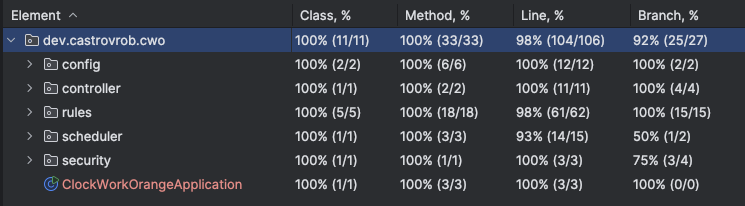

# Clock Work Orange 🕰️🍊


A **Spring Boot** application that makes you wonder about time travel. 🚀 

Just kidding! It's a simple clock application that prints different messages based on the current time. 🕰️

The purpose of this project besides having fun and learn a trick or two, is to showcase what I believe are the best of my skills, best practices and creativity in software development.

The application in question must print the following messages each second based on the current time:

- ✅ **`bong`** the very second every hour passes.
- ✅ **`tock`** the very second every minute passes (non-hour).
- ✅ **`tick`** every second, otherwise.

The application should also shut down gracefully after 3 hours of running.

---

## 📌 Table of Contents

1. [Overview](#1-overview)
2. [Dedication](#2-dedication-)
3. [Considerations and Assumptions](#3-considerations-and-assumptions-)
4. [Architecture & Design](#3-architecture--design-)
   - [Priority-based Rule Evaluation](#-priority-based-rule-evaluation)
   - [Configuration & Decoupling](#-configuration--decoupling)
   - [Scheduling](#-scheduling)
   - [Shutdown After 3 Hours](#-shutdown-after-3-hours)
5. [Project Structure](#4-project-structure-)
6. [Installation & Setup](#5-installation--setup)
7. [Runtime Configuration Changes](#6-runtime-configuration-changes)
8. [Running the Application](#7-running-the-application)
9. [Test Coverage](#8-test-coverage)

---

## **1️⃣ Overview**

**Clock Work Orange** 🍊 (Why orange? Why **NOT** orange? 🤷‍♂️) is a minimal **time-based** event processor built with **Spring Boot.**

A scheduled job runs every second to determine if the current time matches:
- **the top of the hour** → prints **"bong"**
- **the top of the minute (non-hour)** → prints **"tock"**
- **otherwise** → prints **"tick"**

### **Key Features**
- **Priority-based rule evaluation** to handle time-based events.
- **Spring Scheduling (`@Scheduled`)** to trigger the logic every second.
- **Graceful shutdown after 3 hours** using `SpringApplication.exit(...)`.
- **Decoupled configuration** for messages, runtime duration and security.
- **Secure API** for runtime message modification. 
- **Unit & Integration tests** for core functionalities.

---

## **2️⃣ Dedication** 
I want to dedicate every project, including this one to my **wife** and our future **child**.
To my lovely wife: the source of all my strength and inspiration. Nobody works as hard as you.
To our future baby: whose arrival fills me with hope, purpose, and the determination to go above and beyond each day.
Every clock's **tick** is a reminder of a life filled with precious moments of endless love, and adventures together.

Naty & Bebit@ 🤰👶🏻🩵🩷
Les amo!

---

## **3️⃣ Considerations and Assumptions 🤔💭**
- The moment the application starts running is considered **the beginning of the first hour** regarding run execution time.
- The minimum configuration allowed for run duration is one hour, 0 hours is an invalid configuration.
- The one seconds, one minute and one hour intervals will be aligned with LocalDateTime clock.
- The application should be **production-ready!!** 😅🚀
- **All rule messages must be configurable dynamically**, allowing to be changed during runtime.
- **Tests should ensure stability**, including rule evaluation, config and scheduling.

---

## **3️⃣ Architecture & Design 🛠️**

### **🔹 Priority-based Rule Evaluation**
Rules are defined using a **priority-based evaluation** to ensure only one message is printed per second:
1. **Hour Rule (`bong`)** → Executes first if `minute=0` & `second=0`.
2. **Minute Rule (`tock`)** → Executes if `second=0` (but not on the hour).
3. **Second Rule (`tick`)** → Executes as a fallback.

Rules are **sorted by priority**, and the first matching rule determines the output.

#### **Implementation**
- **Rules are stored dynamically** and provided by `RuleProvider`.
- **Evaluation happens inside `PriorityRuleEvaluator`**, selecting the highest-priority match.

### **🔹 Configuration & Decoupling**
Messages for **hour**, **minute**, and **second** are defined in `rules.json` and accessed dynamically by the `RuleProvider`. This keeps business logic separate from configuration, allowing easy customization.

#### **Example Rule Configuration(`rules.json`)**
```json
[
  {
    "type": "hour",
    "priority": 0,
    "message": "bong"
  },
  {
    "type": "minute",
    "priority": 1,
    "message": "tock"
  },
  {
    "type": "second",
    "priority": 2,
    "message": "tick"
  }
]
```

#### **Example Configuration (`application.yml`)**
```yaml
clock:
  run:
    duration: 3  # Application runs for 3 hours before shutting down
    token: Bearer valid-token
```


### **🔹 Scheduling**
A single method annotated with `@Scheduled(fixedRate = 1000)` execute every second:
1. Fetches current time.
2. Passes it to the `PriorityRuleEvaluator` to retrieve the appropriate message.
3. Logs the selected message.

### **🔹 Shutdown After 3 Hours.**
- The application records its start time at launch.
- Every second, it checks the elapsed time.
- Once 3 hours have passed, SpringApplication.exit(...) is triggered for graceful shutdown.

---

## **4️⃣ Project Structure 📁**
This is the project package structure:
```bash

📂 src/main/java/dev/castrovrob/cwo
 ┣ 📂 config         # Configuration properties & services
 ┣ 📂 controller     # API layer for runtime rule updates
 ┣ 📂 rules          # Rule provider & evaluation logic
 ┣ 📂 scheduler      # Scheduling logic
 ┗ 📂 security       # Token authentication (for API security)
```

---

## **5️⃣ Installation & Setup**
### **🔹 Prerequisites**
- Java 21
- Maven
- Spring Boot 3.x

### **🔹 Clone and build**
```bash

git clone https://github.com/your-repo/clock-work-orange.git
cd clock-work-orange
mvn clean install -U -X
```

Please keep in mind that PMD and code style checks are enforced by the compiler in this project.

### **🔹 CI/CD**
Build and deploy to a cloud VM or PROD environment is considered as well.
A few steps are needed tho.
 - Setup a token with workflow entitlements if needed.
 - Need to setup github secrets for user and token, as well for the VM SSH credentials
 - Ideally the ssh github user must be able to login with a password-less configuration using a certificate.

There is a simple example for the ci/cd workflow in `.github/workdflows/ci-cd.yml`

---

## **6️⃣ Runtime Configuration Changes**
Message configurations can be updated at runtime using the following command:
```bash

curl -X PUT "http://localhost:8080/api/v1/rules/{type}?newMessage={newMessage}" \
-H "Authorization: {authHeader}"
```

Parameters:
- **type:** The type of the rule to update (e.g., hour, minute, second).
- **newMessage:** The new message to set for the specified rule type.
- **authHeader:** The authorization token for validating the request.

Response:
- **200 OK:** If the rule message is updated successfully.
- **401 Unauthorized:** If the provided token is invalid.
- **404 Not Found:** If the specified rule type does not exist.
---

## **7️⃣ Running the application**
```bash

mvn spring-boot:run
```
To run with a specific profile (e.g. prod or test):
```bash

mvn spring-boot:run -Dspring-boot.run.profiles=prod
```

---

## **8️⃣ Test Coverage**
Test coverage is above **98%** for line coverage in this project.
